# 以太坊DAPP开发-彩票的设计与实现

## 一.项目背景

​	传统的彩票网站存在暗箱操作，容易贪污跑路的问题，而基于以太坊的彩票网站，则有着公开，公正，公平的优点。

## 二.业务需求

1.全民参与（任何地址都可以投注）

2.每个人每次只能投1个ether（相当于2元1注）

3.每个人可以买多注

4.设置一个管理员，负责：

- 定期开奖
- 临时退奖（防止有特殊情况）

## 三.项目框架图

​	

#### 项目模块交互演示图

​	

## 四.合约设计

### 合约需要的状态变量

​	   1.管理员：manager ，address类型

​	   2.记录所有的彩民的地址集合：players，address[]类型

​	   3.第几期：round  int

​	   4.上一期的中奖地址：winner，address

### 合约中的方法

​	   1.参与投奖：play() payable（任何人都可以调用，调用时转入1ether到合约）

​	   2.管理员专用

​			-开奖：draw（）选择一个随机的地址，将合约的钱转入这个地址；

​			-退奖：undraw（）遍历所有的彩民，依次向彩民池中的地址转账，每人转账1ether。

**注意点：**

1. 退奖和开奖时需要花费的手续费是管理员地址账户中的钱；
2. 投奖时花费的手续费是用户账户中的钱；
3. 一句话：谁调用合约中的方法就花费谁的钱；
4. 对于用户来说，进出都是1eth永远不变；

### 合约代码

```js
pragma solidity ^0.4.25;

contract Lottery{
    //管理员地址
    address public manager;
    //所有彩民
    address[] public players;
    //彩票期数
    uint public round;
    //上一期中奖地址
    address public winner;
    //添加管理员地址
    constructor() public{
        manager=msg.sender;
    }

    //参与投奖
    function play() public payable{
        //要求调用时转入
        require(msg.value==1 * 10 ** 18);
        players.push(msg.sender);
    }
    //管理员开奖
    function draw() public onlyManager{
        //以太坊中没有提供随机数生成方法，可以随机生成一个哈希数，并将它对数组长度取余
        //取当前的难度值，时间戳和彩民人数作为随机数的种子
        bytes memory info = abi.encodePacked(block.difficulty,block.timestamp,players.length);
        bytes32 hash = keccak256(info);
        uint index = uint(hash)%players.length;
        winner = players[index];
        winner.transfer(address(this).balance);
        //彩民池清空同时期数加1
        delete players;
        round++;
    }
    
    //管理员退奖
    function undraw() public onlyManager{
        //遍历彩民数组，依次向彩民转账
        for(uint256 i=0;i<players.length;i++){
            players[i].transfer(1 ether);
        }
        delete players;
        round++;
    }
    /*******************辅助函数*************************/
    //获取奖金池额度
    function getBalance() public view returns(uint256){
        return address(this).balance;
    }
    //获取当前彩民
    function getPlayers() public view returns(address[]){
        return players;
    }
    //添加修饰器
    modifier onlyManager(){
        require(msg.sender==manager);
        _;
    }
}
```

## 五.前端部署（react）	

### **创建react空工程**

```sh
npm  i -g  create-react-app //安装react脚手架
create-react-app lottery	//创建项目文件夹
npm run start //运行react空工程
```

### **清理react空工程**

​	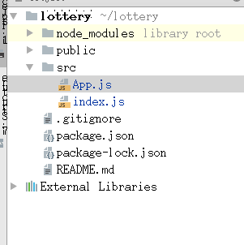

​	src文件夹下只保留App.js和index.js;

​	App.js以及Index.js文件夹下保留的内容：

```js
//App.js
import React from 'react';

function App() {
  return (
    <div className="App">
      hellowrold!
    </div>
  );
}
export default App;

//index.js
import React from 'react';
import ReactDOM from 'react-dom';

import App from './App';


ReactDOM.render(<App />, document.getElementById('root'));
```

​	浏览器中输入localhost:3000看到如下结果表示运行成功：	

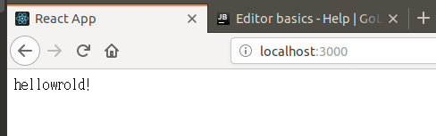

## 六.合约部署测试

### **安装solc编译器**

```sh
//执行该命令必须与package.json位于同一文件夹下
cd lottery
npm install solc@0.4.25 --save
```

### **安装web3**

```sh
//执行该命令必须与package.json位于同一文件夹下
cd lottery
node install web3@1.2.1 --save
```

### **启动命令行版本Ganache**

```sh
//如果没有命令行版本Ganache需要先进行安装
npm install ganache-cli -g
//启动巧克力
ganache-cli
```

​	启动之后如果出现如下情况表示Gananche安装成功：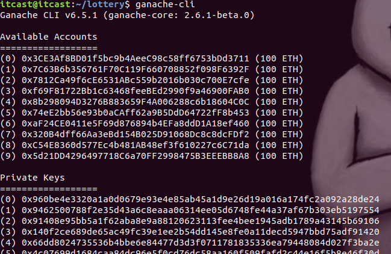

### 使用指定方式启动Ganache

​	每次输入ganache-cli启动后，会有如下特点：

- ​		默认的服务为：Listening on 127.0.0.1:8545。
- ​		每次启动时，10个地址是变化的，不太方便。

​	在这里我们使用参数指定启动的数据:

​		genache-cli  -m    指定“助记词”，

​					-h     指定“ip”，

​					-p      “port”。

#### 获取助记词的方法

```
ganache-cli 
```

​     	启动后可以看到如下界面：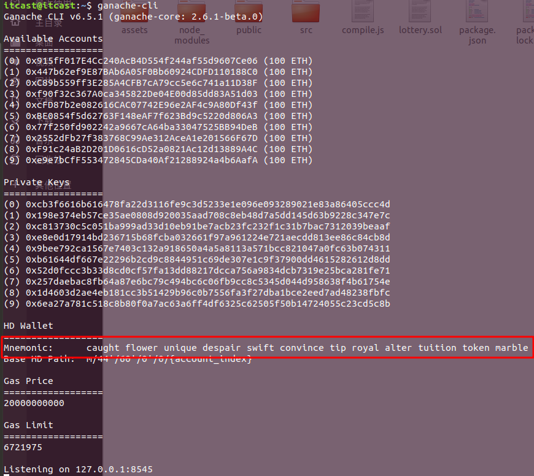

如图中所示，Mnemonic即为助记词，拷贝这些助记词；

#### 通过助记词启动ganache-cli

```sh
ganache-cli -h 127.0.0.1 -p 7545 -m "caught flower unique despair swift convince tip royal alter tuition token marble"
```

#### 导入助记词到MetaMask

​	启动MetaMask,选择从助记词还原

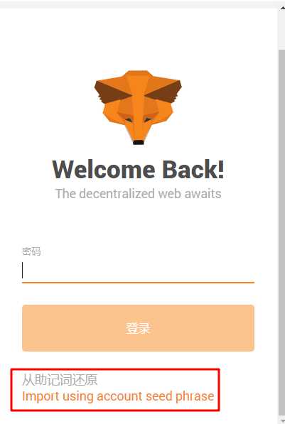

​		将助记词拷贝至wallet seed并设置新密码

​		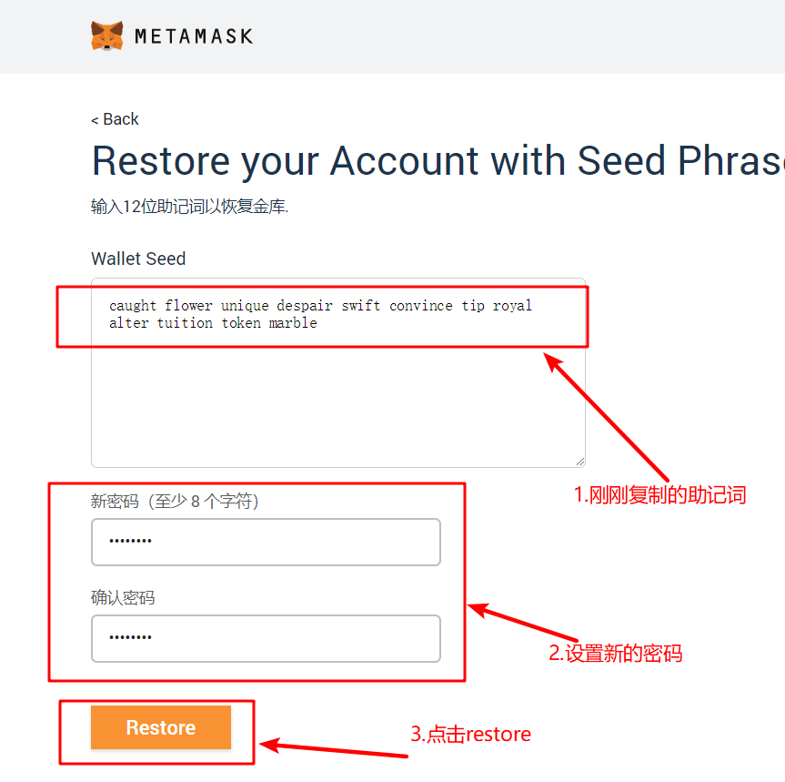

此时MetaMask已经连接到ganache-cli，可以通过MetaMask对ganache-cli中的账户进行转账或查看操作，从而模拟用户的真实操作。

### 合约编译部署

在lottery文件夹下创建compile.js，并编写代码如下：

```js
let fs = require('fs')
let solc = require('solc')


//指定utf-8，返回的就是一个string字符串，下面编译的时候，就不需要使用toString()方法
//如果不指定utf-8，返回的就是Buffer, 那么下面编译时，需要使用toString()方法
let contractInfo = fs.readFileSync('./lottery.sol', 'utf-8')

let compiledInfo = solc.compile(contractInfo, 1)
console.log(compiledInfo)

//JSON.parse(字符串) => 转换成一个json对象
// JSON.stringfy(json对象) => 转换成一个string

let res = fs.writeFileSync('./compileInfo.json', JSON.stringify(compiledInfo), 'utf-8')


module.exports = compiledInfo['contracts'][':Lottery']

```

在lottery文件夹下创建deploy.js，并编写代码如下：

```js
let {
    bytecode,
    interface
} = require('./compile')

let Web3 = require('web3')

console.log('bytecode :', bytecode)
console.log('interface :', interface)

//初始化web3
//ganache-cli本地测试环境，不需要指定助记词就可以使用里面的账户
let web3 = new Web3('http://127.0.0.1:7545')

let deploy = async () => {
    let accounts = await web3.eth.getAccounts()

    console.log('accounts : ', accounts)

    //填写abi, 第二参数是合约地址，部署的时候不用填写
    let contract = new web3.eth.Contract(JSON.parse(interface))

    //填写bytecode和构造函数参数
    contract.deploy({
        data: bytecode,
        // arguments:[], //如果没有构造函数参数，可以不写这个字段
    }).send({
        from: accounts[0],
        // to :  //部署合约时，不需要填写to字段
        value: 0,
        // gas : '8000000000', 如果太小，创建交易时gas不足，会失败。如果过多，会提示超出gas上限，最多800万gas
        gas: '800000'
    }).then(res => {
        console.log('新部署合约的地址为: ', res.options.address)
    }).catch(err => {
        console.log('部署合约失败:', err)
    })
}

deploy()

```

执行如下命令：

```shell
node compile.js
node deploy.js

```

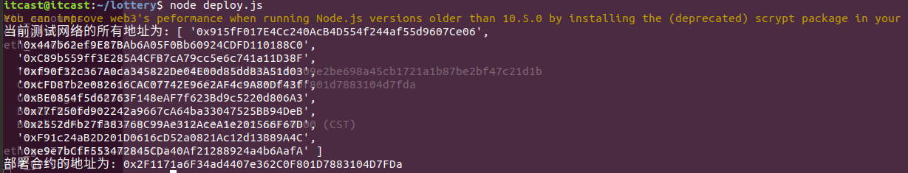

得到上述地址表示合约部署成功。

## 七.项目模块设计与实现

​	根据项目框架图可知，项目整体采用MVC架构，其中controller层使用react工程初始化的App.js，Model层和View层需要另外创建。

​	在lottery/src文件夹下创建eth文件夹和display文件夹；

```sh
cd ./lottery/src
mkdir eth    //model层代码
mkdir display//view层代码

```

### 获取合约实例

```sh
cd ./lottery/src/eth
touch getInstance.js

```

​	获取合约实例需要通过ABI和部署地址，ABI可以通过我们执行compile.js中的compile.json获取，也可以通过remix在线编译器获取；

​	

地址可以通过编译deploy.js后的地址获取。

getInstance.js代码如下：

```js
//根据ABI和部署地址获得合约实例
const ABI = [ { "constant": false, "inputs": [], "name": "draw", "outputs": [], "payable": false, "stateMutability": "nonpayable", "type": "function" }, { "constant": true, "inputs": [], "name": "getBalance", "outputs": [ { "name": "", "type": "uint256" } ], "payable": false, "stateMutability": "view", "type": "function" }, { "constant": true, "inputs": [], "name": "round", "outputs": [ { "name": "", "type": "uint256" } ], "payable": false, "stateMutability": "view", "type": "function" }, { "constant": true, "inputs": [], "name": "manager", "outputs": [ { "name": "", "type": "address" } ], "payable": false, "stateMutability": "view", "type": "function" }, { "constant": true, "inputs": [], "name": "getPlayers", "outputs": [ { "name": "", "type": "address[]" } ], "payable": false, "stateMutability": "view", "type": "function" }, { "constant": false, "inputs": [], "name": "play", "outputs": [], "payable": true, "stateMutability": "payable", "type": "function" }, { "constant": true, "inputs": [], "name": "winner", "outputs": [ { "name": "", "type": "address" } ], "payable": false, "stateMutability": "view", "type": "function" }, { "constant": false, "inputs": [], "name": "undraw", "outputs": [], "payable": false, "stateMutability": "nonpayable", "type": "function" }, { "constant": true, "inputs": [ { "name": "", "type": "uint256" } ], "name": "players", "outputs": [ { "name": "", "type": "address" } ], "payable": false, "stateMutability": "view", "type": "function" }, { "inputs": [], "payable": false, "stateMutability": "nonpayable", "type": "constructor" } ]
const Address = '0x2F1171a6F34ad4407e362C0F801D7883104D7FDa';

//实例化web3
let Web3 = require('web3');
let web3 = new Web3('http://127.0.0.1:7545');

//获取合约实例
let lotteryIntance = new web3.eth.Contract(ABI,Address);
//将合约实例导出，这样在其他地方就可以直接与合约交互
//如果只导出一个对象，可以使用default修饰，这样在导入时可以定义一个其他的名字
export default lotteryIntance


```

改写App.js代码如下：

```js
import React,{Component} from 'react';
import instance from './eth/getInstance'

class App extends Component{
    //生命周期函数，在页面挂载的时候自动执行
    async componentDidMount(){
        let manager = await instance.methods.manager().call()
        console.log('管理员地址：',manager);
    }
    render(){
        return (
            <div className="App">
                hellowrold!
            </div>
        );
    }
}
export default App;


```

​	打开浏览器，访问localhost:3000,按下F12，如果看到控制台输出管理员地址则表示调用成功。

此时表明我们已经可以通过页面获取到合约实例；

##### state状态变量

​	state：内置状态变量，在类内进行数据传递；

```js
State={	a:'',	}

读操作：let a = this.state.a;

写操作：this.setState({a:'hello'});

```

**react中标签内的变量需要使用{}包裹起来，否则会当做字符串显示**

继续改写App.js如下：

```js
import React,{Component} from 'react';
import instance from './eth/getInstance'

class App extends Component{
    //状态变量用于传递数据
    state={
        manager:'',
        round:0,
        winner:'',
        allPlayers:[],
        balance:0,
    }
    //生命周期函数，在页面挂在的时候自动执行
    async componentDidMount(){
        //管理员地址：manager
        let manager = await instance.methods.manager().call();
        //当前的期数：round
        let round = await instance.methods.round().call();
        //上一期中奖者地址：winner
        let winner = await instance.methods.winner().call();
        //玩家数组：players
        let allPlayers = await instance.methods.getPlayers().call();
        //合约里边的金额
        let balance = await instance.methods.getBalance().call();
        //打印上述数据
        let detailInfo ={manager,round,winner,balance};
        console.table(detailInfo);
        //设置状态变量
        this.setState({manager,round,winner,allPlayers,balance});

    }
    render(){
        let {manager,round,winner,allPlayers,balance} = this.state
        return (

            <div className="App">
                <p>hellowrold!</p>
                <p>manager:{manager}</p>
                <p>round:{round}</p>
                <p>winner:{winner}</p>
                <p>allPlayers:{allPlayers}</p>
                <p>balance:{balance}</p>
            </div>
        );
    }
}


export default App;


```

此时运行结果如下图所示：

### 页面UI设计与实现

​	这里简单起见，我们不再手写代码实现UI而是，直接从semantic-ui上拉取一个页面下来。

```sh
//安装semanct-ui-react
npm install semantic-ui-react --save
//安装semanct-ui-css	
npm install semantic-ui-css --save

```

​	浏览器内输入网址：https://react.semantic-ui.com/views/card/#types-card

​	点击try-it如下图所示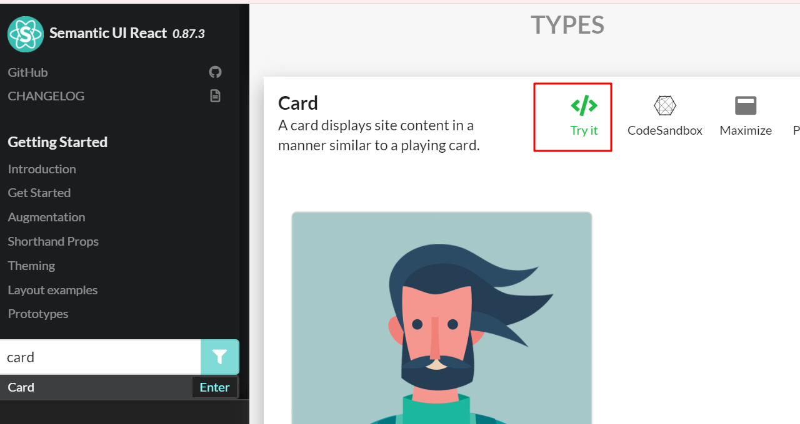

之后下方会出现一段代码，拷贝这段代码，粘贴到display.js下；

```sh
vim ./lottery/src/display/display.js

```

在App.js中引入display.js如下图所示：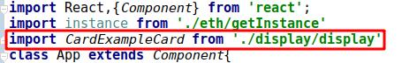

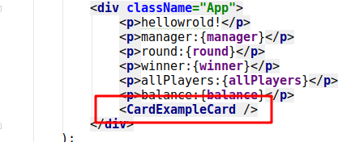

在index.js中引入semantic-ui-css,如下图所示：

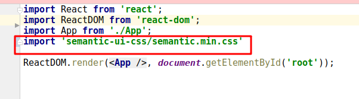

在./lottery/public文件夹下放置彩票logo图片，并修改display.js中的图片放置地址。**注意：图片资源地址的根目录为/public**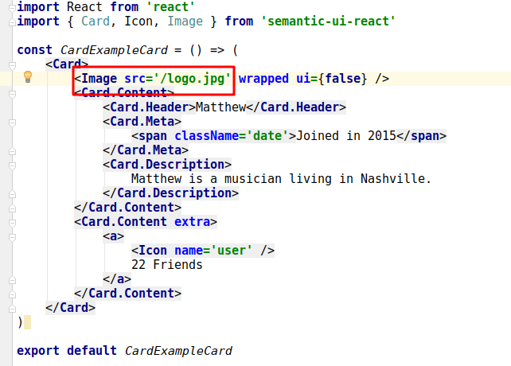

最后效果如下图所示：

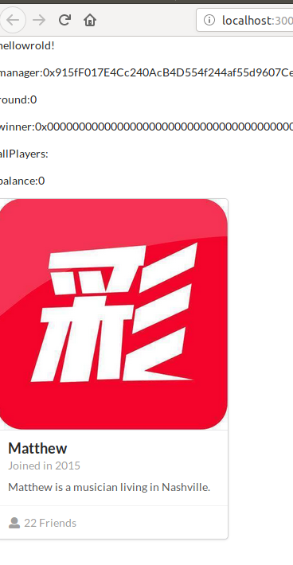

##### 修改页面代码

修改display.js代码如下：

```js
import React from 'react'
import { Card, Icon, Image, Statistic } from 'semantic-ui-react'

const CardExampleCard = () => (
    <Card>
        <Image src='/logo.jpg' wrapped ui={false} />
        <Card.Content>
            <Card.Header>皇家彩票</Card.Header>
            <Card.Meta>开奖员地址:</Card.Meta>
            <p>0x1234567890</p>
            <Card.Meta>当前地址:</Card.Meta>
            <p>0x1234567890</p>
            <Card.Description>全天24小时在线,每周一、周二、周六晚八点开奖</Card.Description>
        </Card.Content>
        <Card.Content extra>
            <a>
                <Icon name='user' />
                10人
            </a>
        </Card.Content>
        <Card.Content extra>
            <Statistic color="red">
                <Statistic.Value>10 ETH</Statistic.Value>
                <Statistic.Label>奖金池</Statistic.Label>
            </Statistic>
        </Card.Content>
        <Card.Content extra>
            <Statistic color="blue">
                <Statistic.Value>第0 期</Statistic.Value>
                <Statistic.Label>期数</Statistic.Label>
                <a>点击我查看交易历史</a>
            </Statistic>
        </Card.Content>
    </Card>
)

export default CardExampleCard

```

### 页面数据导入

​	props：负责多个组件之间的数据传递（包括：数据，函数）;

​	获取数据涉及到不同类之间的数据传递，此时需要使用props；

​	getInstance.js代码改写如下：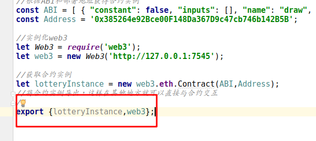

​	App.js代码改写如下：

```js
import React,{Component} from 'react';
import {instance,web3} from './eth/getInstance'
import CardExampleCard from './display/display'
class App extends Component{
    //状态变量用于传递数据
    state={
        manager:'',
        round:0,
        winner:'',
        allPlayers:[],
        balance:0,
        currentAccount:'',
    }
    //生命周期函数，在页面挂在的时候自动执行
    async componentDidMount(){
        //获取所有账户地址
        let accounts = await web3.eth.getAccounts();
        //获取当前账户地址
        let currentAccount = accounts[1];
        //管理员地址：manager
        let manager = await instance.methods.manager().call();
        //当前的期数：round
        let round = await instance.methods.round().call();
        //上一期中奖者地址：winner
        let winner = await instance.methods.winner().call();
        //玩家数组：players
        let allPlayers = await instance.methods.getPlayers().call();
        //合约里边的金额
        let balance = await instance.methods.getBalance().call();
        //打印上述数据
        let detailInfo ={manager,round,winner,balance};
        console.table(detailInfo);
        //设置状态变量
        this.setState({manager,round,winner,allPlayers,balance,currentAccount});

    }
    render(){
        let {manager,round,winner,allPlayers,balance,currentAccount} = this.state
        return (

            <div className="App">
                <CardExampleCard allData={this.state}/>
            </div>
        );
    }
}


export default App;


```

​	display.js代码改写如下：

```js
import React from 'react'
import { Card, Icon, Image, Statistic } from 'semantic-ui-react'

const CardExampleCard = (props) => {
    let allData = props.allData;
    let{manager,round,winner,allPlayers,balance,currentAccount}=allData;
    return(
    <Card>
        <Image src='/logo.jpg' wrapped ui={false} />
        <Card.Content>
            <Card.Header>皇家彩票</Card.Header>
            <Card.Meta>开奖员地址:</Card.Meta>
            <p>{manager}</p>
            <Card.Meta>当前地址:</Card.Meta>
            <p>{currentAccount}</p>
            <Card.Meta>上一期中奖地址:</Card.Meta>
            <p>{winner}</p>
            <Card.Description>全天24小时在线,每周一、周二、周六晚八点开奖</Card.Description>
        </Card.Content>
        <Card.Content extra>
            <a>
                <Icon name='user' />
                    {allPlayers.length}人
            </a>
        </Card.Content>
        <Card.Content extra>
            <Statistic color="red">
                <Statistic.Value>{balance} ETH</Statistic.Value>
                <Statistic.Label>奖金池</Statistic.Label>
            </Statistic>
        </Card.Content>
        <Card.Content extra>
            <Statistic color="blue">
                <Statistic.Value>第{round} 期</Statistic.Value>
                <Statistic.Label>期数</Statistic.Label>
                <a>点击我查看交易历史</a>
            </Statistic>
        </Card.Content>
    </Card>
);}

export default CardExampleCard

```

#### 添加按钮

​	 页面需要三个按钮，分别是开奖、退奖、投注；

App.js页面修改如下：

​		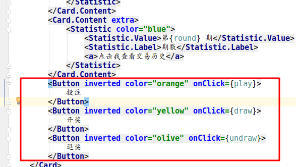

##### 按钮业务逻辑的实现

​	在App.js中添加如下代码：

```js
 //调用的函数
    play=async()=> {
        try{
            await instance.methods.play().send({
                from:this.state.currentAccount,
                value:(1*10)**18
            });
            alert('投注成功');
            window.location.reload(true);
        }catch{
            alert('投注失败');
            window.location.reload(true);
        }

    }
    draw=async()=>{
        try{
            await instance.methods.undraw().send({
                from:this.state.currentAccount,
            });
            //在这里重新设置中将着
            let winner = await instance.methods.winner().call();
            console.log('中奖地址：',winner);
            alert('开奖成功');
            window.location.reload(true);
        }catch{
            alert('开奖失败');
            window.location.reload(true);
        }
    }
    undraw=async()=>{
        try{
            await instance.methods.undraw().send({
                from:this.state.currentAccount,
            });
            alert('退奖成功');
            window.location.reload(true);
        }catch{
            alert('退奖失败');
            window.location.reload(true);
        }
    }
    render(){
        let {manager,round,winner,allPlayers,balance,currentAccount} = this.state
        return (

            <div className="App">
                <CardExampleCard
                    allData={this.state}
                    play={this.play}
                    draw={this.draw}
                    undraw={this.undraw}
                />
            </div>
        );
    }

```

### 链接MetaMask

​	当前项目中，我们的用户是固定的，每次取Ganace中account[1]的地址，在实际业务中，这里需要使用用户自己的provider。

​	在安装MetaMask后，MetaMask会在浏览器中注册一个自己的web3实例，MetaMask在链接网络之后，会生成一个自己的web3 provider。

​	修改getInstance.js如下：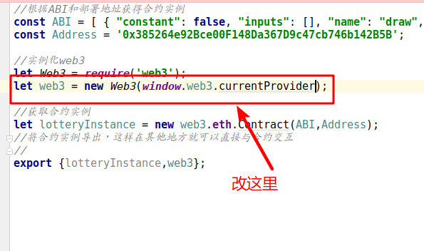

​		

## 八.项目优化

### 单位优化

​	在运行过程中，我们发现投注的单位是wei，但是页面显示要求的单位是ether，会出现如下问题：

​	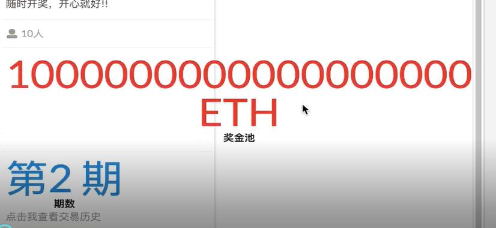

修改App.js代码如下：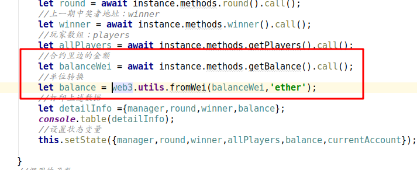
